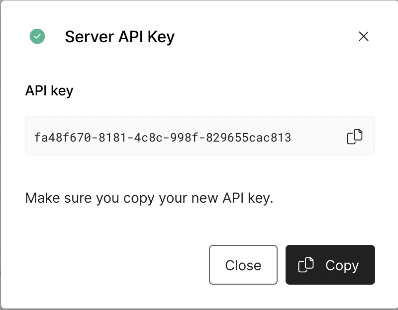
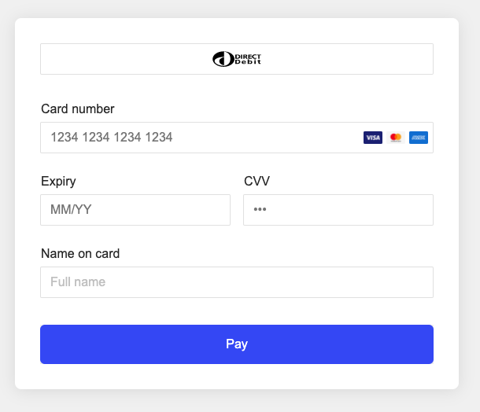

<h1 align="center"> Example Web Checkout</h1>

<h3 align="center">

Example integration of Universal Checkout using the [Primer Web SDK](https://primer.io)

</h3>

<h4 align="center">

This is a companion project to the [Web Getting Start Guide](#).

</p>

---

## 🚀 Get Started

### ✔️ Installation

Clone this repository:

```bash
git clone git@github.com:primer-io/example-web-checkout.git
cd ./example-web-checkout
```

Install the dependencies using `yarn` or `npm`:

```bash
# With yarn
yarn

# With npm
npm i
```

### 🔑 Set up the API Key

Grab your API Key, or create a new API Key, from the [Primer Dashboard](https://dashboard.sandbox.primer.io/developers/apiKeys).



Clone `env.example` and name the cloned file `.env`.

```
cp env.example .env
```

Open `.env` and set the environment variable `API_KEY` with the API key available on your dashboard.

```
# .env
API_KEY=1234-1234-1234-1234 # Your Primer API Key
```

### 🏃‍♂️ Run the server

```bash
# With yarn
yarn start

# With npm
npm start
```

The server is deployed on port `8880` by default. You can change the port by setting the `PORT` environment variable in the `.env` file.

### 💳 Access the checkout

Check the checkout at [http://localhost:8880/](http://localhost:8880/).



## 👀 What's next?

- 📚 Take a look at our [Documentation](https://primer.io/docs) to learn more about customizing Universal Checkout to better fit your needs
- 📖 Explore our [Web SDK Reference](https://www.npmjs.com/package/@primer-io/checkout-web) and [Server API Reference](https://apiref.primer.io)
- 🤙 Reach out to us at [support@primer.io](support@primer.io) if you are facing any issues
